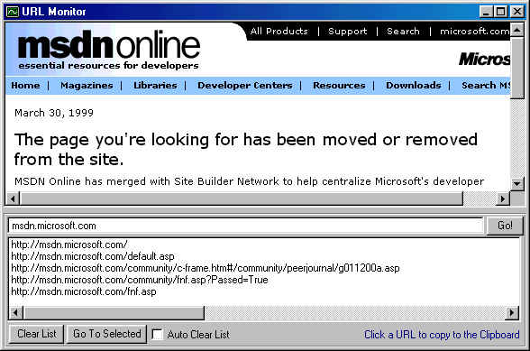



## URL Monitor

### Description

Ever wanted to monitor a site you access? to know which sites are accessed during the access of a site?

Or just get the exact link of a file that linked through CGI or any sort of protected script?

this is it!
 
### More Info
 

             |
---                |---
**Submitted On**   |2000-04-15 14:53:10
**By**             |[Max Raskin](https://github.com/Planet-Source-Code/PSCIndex/blob/master/ByAuthor/max-raskin.md)
**Level**          |Intermediate
**User Rating**    |4.8 (24 globes from 5 users)
**Compatibility**  |VB 5\.0, VB 6\.0
**Category**       |[Complete Applications](https://github.com/Planet-Source-Code/PSCIndex/blob/master/ByCategory/complete-applications__1-27.md)
**World**          |[Visual Basic](https://github.com/Planet-Source-Code/PSCIndex/blob/master/ByWorld/visual-basic.md)
**Archive File**   |[CODE\_UPLOAD48194152000\.zip](https://github.com/Planet-Source-Code/max-raskin-url-monitor__1-7291/archive/master.zip)

